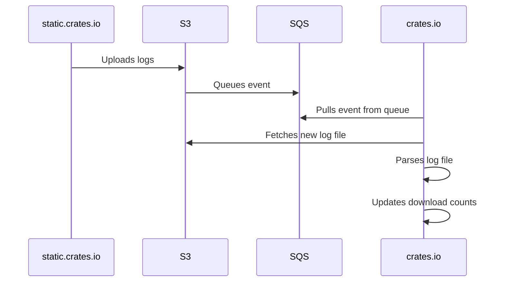

# Infrastructure to Count Crate Downloads

This module creates the infrastructure that enables [crates.io] to count crate
downloads asynchronously using request logs from our Content Delivery Networks.

Whenever a new archive with request logs is uploaded to S3, S3 pushes an event
into a SQS queue. [crates.io] monitors the queue and processes incoming events.
From the event, it can determine what files to fetch from S3, download and then
parse them, and update the download counts in the database.

See [rust-lang/simpleinfra#372] for a detailed discussion of the design.

## AWS Accounts

The infrastructure for [crates.io] has historically been deployed to the
`legacy` AWS account. For this infrastructure, new accounts have been created
that follow the new convention of specialized and isolated accounts for
services.

This requires the S3 bucket with the request logs in the `legacy` account to
push events into the SQS queue in a different account. And the [crates.io]
application needs a second set of AWS credentials to pull events from the
queue.

[crates.io]: https://crates.io
[rust-lang/simpleinfra#372]: https://github.com/rust-lang/simpleinfra/issues/372
