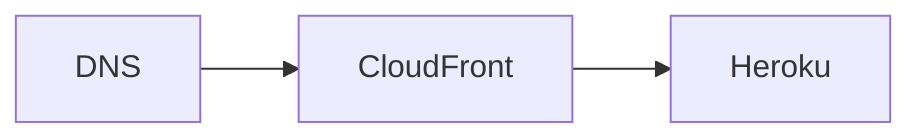
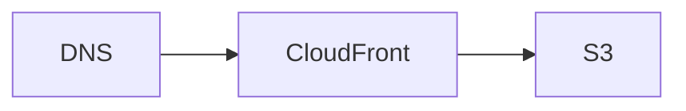
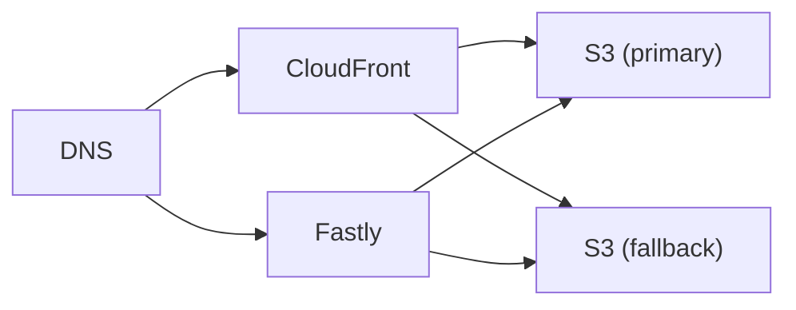

# `crates-io`

This is the [Terraform] module that defines the infrastructure for [crates.io].

[crates.io] consists of a few different components:

  - A web application hosted on [Heroku](https://heroku.com/) (`crates.io`)
  - Static crates stored in S3 (`static.crates.io`)
  - HTTP index stored in S3 (`index.crates.io`)

These are documented in more detail in the following sections.

## Web Application

The user-facing web application for [crates.io] is hosted on Heroku and is not
managed with [Terraform]. But the module configures CloudFront as the CDN for
the app and grants it access to the relevant S3 buckets.

## `index.crates.io`

From an infrastructure perspective, `index.crates.io` is a simple S3 bucket with
CloudFront in front of it.

## `static.crates.io`

`static.crates.io` serves the static crates to users. The crates are stored in
two different S3 buckets that are geographically distributed for disaster
resilience. Traffic is routed through one of two CDNs, either CloudFront or
Fastly, using [load-balancing at the DNS level][weighted-routing].

[crates.io]: https://crates.io/
[terraform]: https://terraform.io/
[weighted-routing]: https://docs.aws.amazon.com/Route53/latest/DeveloperGuide/routing-policy-weighted.html
