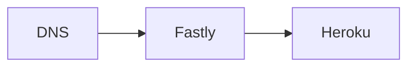
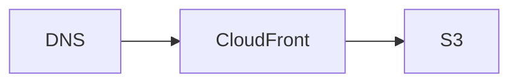
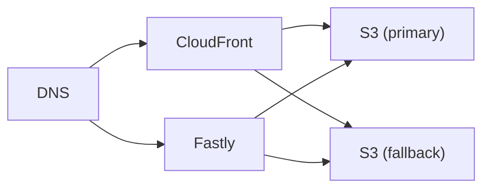

# `crates-io`

This is the [Terraform] module that defines the infrastructure for [crates.io].

[crates.io] consists of a few different components:

  - A web application hosted on [Heroku](https://heroku.com/) (`crates.io`)
  - Static crates stored in S3 (`static.crates.io`)
  - HTTP index stored in S3 (`index.crates.io`)

These are documented in more detail in the following sections.

## Web Application

```mermaid
flowchart LR
    DNS --> Fastly
    Fastly --> Heroku
```

The user-facing web application for [crates.io] is hosted on Heroku and is not
managed with [Terraform]. The module configures Fastly as the normal CDN path,
including its Next-Gen WAF, and retains CloudFront as an alternative path.

In production, the CloudFront distribution is disabled, and the direct `cloudfront-app.crates.io` hostname is not
published. Set `webapp_cloudfront_enabled` to enable the distribution and
publish its direct hostname, then set `webapp_cloudfront_weight` to a positive
value to route traffic to it.
In staging, CloudFront remains enabled and is available at
`cloudfront-app.staging.crates.io` for direct testing, even if its DNS traffic
weight is zero.

## `index.crates.io`

```mermaid
flowchart LR
    DNS --> CloudFront
    CloudFront --> S3
```

From an infrastructure perspective, `index.crates.io` is a simple S3 bucket with
CloudFront in front of it.

## `static.crates.io`

```mermaid
flowchart LR
    DNS --> CloudFront
    DNS --> Fastly

    CloudFront --> S3Primary["S3 (primary)"]
    CloudFront --> S3Fallback["S3 (fallback)"]

    Fastly --> S3Primary["S3 (primary)"]
    Fastly --> S3Fallback["S3 (fallback)"]
```

`static.crates.io` serves the static crates to users. The crates are stored in
two different S3 buckets that are geographically distributed for disaster
resilience. Traffic is routed through one of two CDNs, either CloudFront or
Fastly, using [load-balancing at the DNS level][weighted-routing].

### Fastly

We use Fastly's [Compute@Edge] workers to serve the static crates, which mirror
the functionality of the CloudFront distribution. The logic of these workers is
implemented in the [`compute-static`](./compute-static) crate within the
Terraform module.

When applying changes to the infrastructure, an external data source in
Terraform builds the compute function. This ensures that the latest version gets
deployed.

[crates.io]: https://crates.io/
[compute@edge]: https://www.fastly.com/products/edge-compute
[terraform]: https://terraform.io/
[weighted-routing]: https://docs.aws.amazon.com/Route53/latest/DeveloperGuide/routing-policy-weighted.html
