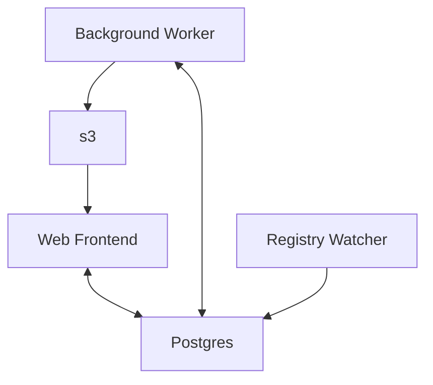
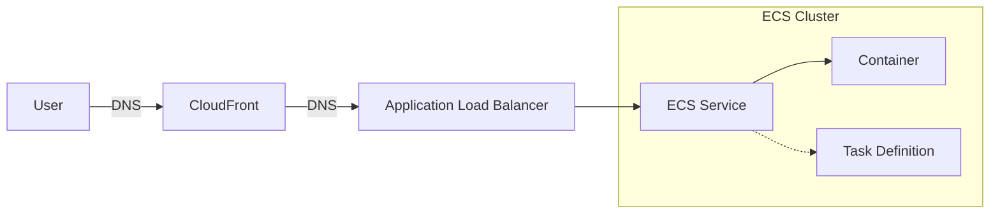

# `docs-rs`

This is the [Terraform] module that defines the infrastructure for [docs.rs].

**NOTE**: As of Feb 2023, this infrastructure configuration is only used for the docs.rs staging environment. The production environment running on docs.rs is using a different architecture. The plan of record is to move production to using this configuration.

## Overview

[docs.rs] consists of a few different components:

- A web frontend hosted as a container running in an [ECS] cluster.
- A background documentation builder running on [ec2](https://aws.amazon.com/ec2) instances as part of an [autoscaling](https://aws.amazon.com/ec2/autoscaling) group.
- A background utility (**TODO**: this is currently not configured) which includes:
  - crate registry watcher that watches for changes to the crates registry and enqueues doc builds
  - the repository stats updater that ensures # stars, # issues, etc. from GitHub & GitLab are up-to-date
  - the CDN invalidation queue handler

These are documented in more detail below.

Data is stored in two different locations:

  - Static rendered crate documentation is stored in [S3](https://aws.amazon.com/s3).
  - Other data is stored in a postgresql database [RDS](https://aws.amazon.com/rds) instance.

### The Flow

The registry watcher watches the registry for new entries. When a new crate is added, it adds that crate to a queue stored in the database. The background worker watches the queue and works off crates from the queue as quickly as possible. It builds crate documentation and stores the artifacts in s3, adds relevant information to the database, and removes the crate from the queue. The web frontend then displays that information to the user.

## Web Frontend

The user-facing web frontend for [docs.rs] is hosted on AWS [ECS]. Requests go through several hops on their way from the [CloudFront] distribution through the ECS Cluster to an ECS service and ultimately an ECS task which contains a container running the docs.rs web server. Many of these steps are behind a domain name which is configured in AWS [Route 53].

## Background Worker

**TODO**: the background worker is work in progress. Once it is fully configured, we should document how it works here.

## Registry Watcher

**TODO**: the registry watcher is work in progress. Once it is fully configured, we should document how it works here.

[terraform]: https://terraform.io
[docs.rs]: https://docs.rs
[ECS]: https://aws.amazon.com/ecs
[CloudFront]: https://aws.amazon.com/cloudfront
[Route 53]: https://aws.amazon.com/route53/
